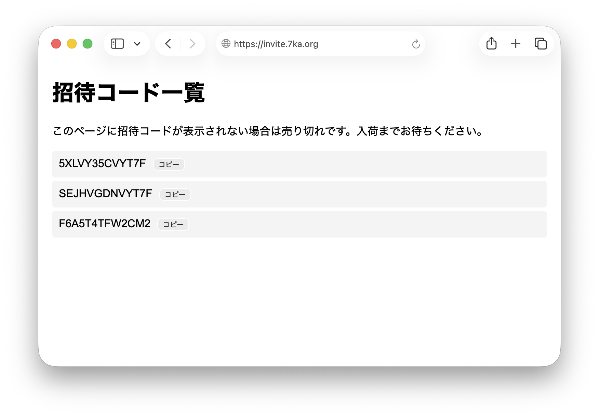

# Misskey招待コード一覧ページ

Misskeyの招待コード一覧を表示するWebページです。  
Cloudflare Workersで動作します。



開発環境をインストールします。

```
npm install -g wrangler
```

.dev.varsを作り、MisskeyのドメインとTOKENを記載します。  
本番環境にデプロイする際は、MISSKEY_TOKENはシークレット変数に設定してください。

```
MISSKEY_HOST=misskey.example.com
MISSKEY_TOKEN=xxxxxx(招待コードを見るの権限がついたAPI token)
```

次のコマンドで開発環境を起動します。

```
npx wrangler dev
```

